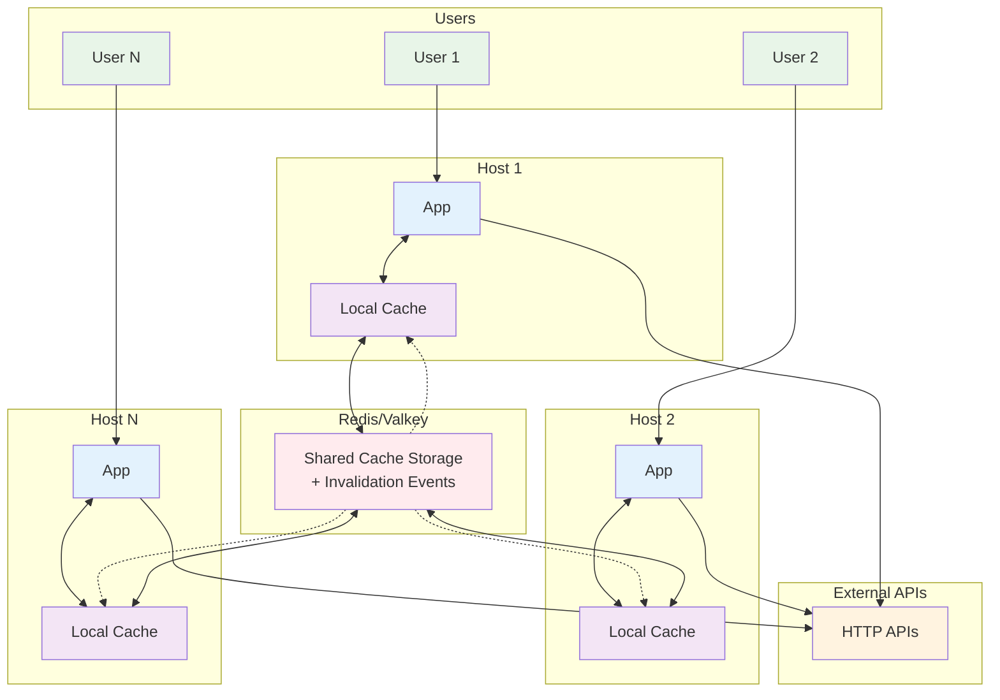
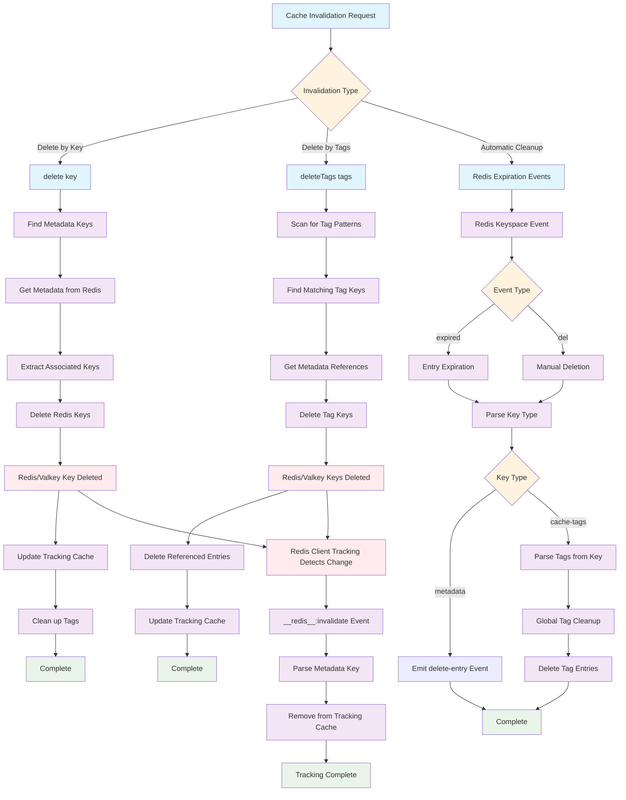

# undici-cache-redis

A high-performance Redis-backed cache store for [Undici's](https://github.com/nodejs/undici) cache interceptor. This library provides seamless HTTP response caching with Redis/Valkey as the storage backend, featuring client-side caching, cache invalidation by tags, and support for managed Redis environments.

Built on top of [iovalkey](https://github.com/valkey-io/iovalkey) for optimal Redis/Valkey connectivity.

## Features

- 🚀 **High Performance**: Redis-backed caching with client-side optimization
- 🏷️ **Cache Tags**: Invalidate cached responses by custom tags
- 🔄 **Automatic Invalidation**: Smart cache invalidation on mutating operations
- 📊 **Cache Management**: Built-in cache manager for monitoring and administration
- 🌐 **Vary Header Support**: Proper handling of content negotiation
- ☁️ **Cloud Ready**: Works with managed Redis services (AWS ElastiCache, etc.)
- 💾 **Binary Support**: Handles both text and binary response data
- 📈 **Tracking Cache**: Client-side caching for improved performance

## Installation

```bash
npm install undici-cache-redis
```

## Quick Start

### Basic Usage

```javascript
import { Agent, interceptors } from 'undici'
import { RedisCacheStore } from 'undici-cache-redis'

// Create a Redis cache store
const store = new RedisCacheStore({
  clientOpts: {
    host: 'localhost',
    port: 6379,
    keyPrefix: 'my-app:cache:'
  }
})

// Create Undici agent with caching
const agent = new Agent()
  .compose(interceptors.cache({ store }))

// Make requests - responses will be automatically cached
const response = await agent.request({
  origin: 'https://api.example.com',
  method: 'GET',
  path: '/users/123'
})

console.log(await response.body.text())
```

### Cache Invalidation by Tags

```javascript
import { Agent, interceptors } from 'undici'
import { RedisCacheStore } from 'undici-cache-redis'

const store = new RedisCacheStore({
  cacheTagsHeader: 'cache-tags' // Header to read cache tags from
})

const agent = new Agent()
  .compose(interceptors.cache({ store }))

// Server responds with: Cache-Tags: user:123,profile
const response = await agent.request({
  origin: 'https://api.example.com',
  method: 'GET',
  path: '/users/123'
})

// Later, invalidate all cached responses tagged with 'user:123'
await store.deleteTags(['user:123'])
```

### Advanced Cache Management with RedisCacheManager

```javascript
import { RedisCacheStore, RedisCacheManager } from 'undici-cache-redis'

// Create both store and manager
const store = new RedisCacheStore({
  cacheTagsHeader: 'cache-tags'
})

const manager = new RedisCacheManager({
  clientOpts: { host: 'localhost', port: 6379 }
})

// Subscribe to cache events
await manager.subscribe()

manager.on('add-entry', (entry) => {
  console.log('Cache entry added:', entry.path, entry.cacheTags)
})

manager.on('delete-entry', ({ id, keyPrefix }) => {
  console.log('Cache entry deleted:', id)
})

// Analyze cache contents
await manager.streamEntries((entry) => {
  console.log(`Entry: ${entry.path}, Tags: [${entry.cacheTags.join(', ')}]`)
}, '')

// Invalidate by tags using the store
await store.deleteTags(['user:123', 'products'])

// Clean up specific entries by ID
const entriesToDelete = []
await manager.streamEntries((entry) => {
  if (entry.path.startsWith('/api/products/')) {
    entriesToDelete.push(entry.id)
  }
}, '')

if (entriesToDelete.length > 0) {
  await manager.deleteIds(entriesToDelete, '')
}

// Get response body for debugging
const responseBody = await manager.getResponseById('some-entry-id', '')
```

### Cache Management

```javascript
import { RedisCacheManager } from 'undici-cache-redis'

const manager = new RedisCacheManager({
  clientOpts: {
    host: 'localhost',
    port: 6379
  }
})

// Subscribe to cache events
await manager.subscribe()

manager.on('add-entry', (entry) => {
  console.log('Cache entry added:', entry.id)
})

manager.on('delete-entry', ({ id, keyPrefix }) => {
  console.log('Cache entry deleted:', id)
})

// Stream all cache entries
await manager.streamEntries((entry) => {
  console.log('Entry:', entry.origin, entry.path, entry.statusCode)
}, 'my-app:cache:')

// Get response body by ID
const responseBody = await manager.getResponseById('entry-id', 'my-app:cache:')
```

## Configuration Options

### RedisCacheStore Options

```typescript
interface RedisCacheStoreOpts {
  // Use "cluster" for Valkey/Redis Cluster shards, or "auto" to use
  // Cluster when multiple startupNodes are supplied
  mode?: "standalone" | "cluster" | "auto"

  // Valkey/Redis Cluster startup nodes and iovalkey cluster options
  startupNodes?: ClusterNode[]
  clusterOptions?: ClusterOptions

  // Prefix applied by this library. Prefer this over clientOpts.keyPrefix.
  keyPrefix?: string

  // Redis client options (passed to iovalkey)
  clientOpts?: {
    host?: string
    port?: number
    keyPrefix?: string
    // ... other iovalkey options
  }
  
  // Maximum size in bytes for a single cached response
  maxEntrySize?: number
  
  // Maximum total cache size (for client-side cache)
  maxSize?: number
  
  // Maximum number of entries (for client-side cache)
  maxCount?: number
  
  // Enable/disable client-side tracking cache (default: true)
  tracking?: boolean
  
  // Header name to read cache tags from responses
  cacheTagsHeader?: string
  
  // Error callback function
  errorCallback?: (err: Error) => void
}
```

### RedisCacheManager Options

```typescript
interface RedisCacheManagerOpts {
  // Redis client options
  clientOpts?: {
    host?: string
    port?: number
    // ... other iovalkey options
  }
  
  // Whether to configure keyspace event notifications (default: true)
  // Set to false for managed Redis services
  clientConfigKeyspaceEventNotify?: boolean
}
```

## Advanced Usage Examples

### Using with fetch()

```javascript
import { Agent, interceptors, setGlobalDispatcher } from 'undici'
import { RedisCacheStore } from 'undici-cache-redis'

// Create a Redis cache store
const store = new RedisCacheStore()

// Create agent with caching
const agent = new Agent()
  .compose(interceptors.cache({ store }))

// Set as global dispatcher to enable caching for fetch
setGlobalDispatcher(agent)

// Now fetch() automatically uses the cache!
const response = await fetch('https://api.example.com/users/123')
const data = await response.json()

// Cache headers are available
if (response.headers.get('x-cache') === 'HIT') {
  console.log('Response was served from cache!')
}
```

### Working with Vary Headers

```javascript
const store = new RedisCacheStore()
const agent = new Agent()
  .compose(interceptors.cache({ store }))

// Different responses cached based on Accept-Language header
const responseEn = await agent.request({
  origin: 'https://api.example.com',
  method: 'GET',
  path: '/content',
  headers: { 'Accept-Language': 'en' }
})

const responseFr = await agent.request({
  origin: 'https://api.example.com',
  method: 'GET',
  path: '/content',
  headers: { 'Accept-Language': 'fr' }
})
```

### Manual Cache Operations

```javascript
const store = new RedisCacheStore()

// Delete specific cache entries
await store.deleteKeys([
  { origin: 'https://api.example.com', method: 'GET', path: '/users/123' }
])

// Delete by cache tags
await store.deleteTags(['user:123', 'profile'])

// Close the store when done
await store.close()
```

### Error Handling

```javascript
const store = new RedisCacheStore({
  errorCallback: (err) => {
    console.error('Cache error:', err.message)
    // Send to monitoring service
    monitoringService.error('cache_error', err)
  }
})
```

## Managed Redis Services

When using managed Redis services like AWS ElastiCache, some Redis commands may be restricted. Configure the cache manager accordingly:

```javascript
const manager = new RedisCacheManager({
  clientConfigKeyspaceEventNotify: false, // Disable auto-configuration
  clientOpts: {
    host: 'your-elasticache-endpoint.cache.amazonaws.com',
    port: 6379
  }
})
```

Ensure your managed Redis instance has the following configuration:
- `notify-keyspace-events AKE` (if not automatically configured)

## Multi-Host Architecture



**Flow**: Users make requests → Apps check local/Redis cache → If miss, fetch from APIs → Cache responses → Invalidation events sync all hosts.

## Cache Key Structure

The library uses a structured approach to Redis keys:

- **Metadata keys**: `{prefix}metadata:{urlMethodHash}:{origin}:{path}:{method}:{id}`
- **Value keys**: `{prefix}values:{urlMethodHash}:{id}`
- **ID keys**: `{prefix}ids:{urlMethodHash}:{id}`
- **Tag keys**: `{prefix}cache-tags:{urlMethodHash}:{tag1}:{tag2}:{id}`
- **URL/method index keys**: `{prefix}cache:v2:{urlMethodHash}:index`
- **URL method set keys**: `{prefix}cache:v2:{urlHash}:methods`
- **Tag index keys**: `{prefix}cache:v2:tag:{tagHash}`
- **Global tag index keys**: `cache:v2:global-tag:{tagHash}`

Where `{prefix}` is your configured `keyPrefix`. Braced `{urlMethodHash}` and `{tagHash}` portions are Valkey Cluster hash tags, so related entry keys are routed to the same shard. New entries use a deterministic ID derived from URL/method and Vary signature unless an explicit `key.id` is supplied.

Normal cache lookup uses the v2 URL/method index and does not call `SCAN`, `KEYS`, broad pattern matching, or full database iteration. The index stores one field per Vary signature, so lookup cost depends on the number of variants for that URL/method rather than total Valkey key count. Expired or dead index references are cleaned lazily during lookup.

Vary header names are normalized to lower case, request header matching is case-insensitive, and `Vary: *` responses are not written to the cache. When several variants match, the store keeps the previous behavior and returns the most specific variant.

Tag invalidation is maintained at write time through tag indexes. `deleteTags()` reads direct tag index members and deletes affected entries without scanning the keyspace. The legacy tag keys remain for `RedisCacheManager` compatibility.

See [docs/indexed-lookup-architecture.md](docs/indexed-lookup-architecture.md) for the SCAN bottleneck analysis, v2 index schema, Vary signature details, stale cleanup behavior, shard notes, and migration tradeoffs.

### Cluster and Externally Supplied Clients

The constructor remains backward compatible and also accepts additive client options:

```javascript
import { Cluster, Redis } from 'iovalkey'
import { RedisCacheStore } from 'undici-cache-redis'

const standaloneClient = new Redis({ host: 'localhost', port: 6379 })
const standaloneStore = new RedisCacheStore({
  client: standaloneClient,
  clientOpts: { keyPrefix: 'my-app:' }
})

const clusterStore = new RedisCacheStore({
  mode: 'cluster',
  startupNodes: [{ host: '127.0.0.1', port: 7000 }],
  clusterOptions: {
    scaleReads: 'master'
  },
  keyPrefix: 'my-app:'
})

const externalCluster = new Cluster([{ host: '127.0.0.1', port: 7000 }])
const externalClusterStore = new RedisCacheStore({
  client: externalCluster,
  mode: 'cluster'
})
```

When a client is supplied externally, `close()` does not quit that client. Cluster client-side tracking is disabled because Redis/Valkey client-side tracking invalidation subscriptions are node-specific. In cluster mode the short local miss cache is also disabled by default so one pod does not keep returning a recent miss after another pod writes the entry.

For sharded Valkey/Redis Cluster deployments, normal lookup reads the URL/method index on the shard selected by `{urlMethodHash}`. Entry metadata, ID, value, and compatibility tag keys are written with the same hash tag, while tag indexes use tag-derived hash tags and fan out only when invalidation spans multiple URL/method groups.

### Migration Notes

The indexed lookup path intentionally does not scan for legacy-only entries. For existing deployments, either flush cache data during upgrade or run explicit maintenance/migration tooling. SCAN remains available in `RedisCacheManager` and test/maintenance helpers, but not in normal `get()` handling.

### Current Observability Status

OpenTelemetry metrics are planned but not implemented in this slice. Until that lands, avoid relying on metric names or metric attributes described in design discussions as stable API.

## Cache Invalidation Flow

The following diagram illustrates how cache invalidation works across different scenarios:



### Invalidation Methods

1. **Direct Key Deletion**: Targets specific cache entries by URL pattern
2. **Tag-based Deletion**: Removes all entries associated with given cache tags
3. **Automatic Expiration**: Handles Redis TTL expiration and manual deletions
4. **Client-side Tracking**: Maintains local cache consistency via Redis invalidation notifications

## Performance Considerations

1. **Client-side Tracking**: Enabled by default, provides in-memory caching of metadata
2. **Pipeline Operations**: Uses Redis pipelining for batch operations
3. **Binary Data**: Efficiently handles binary responses with base64 encoding
4. **Memory Management**: Configurable size limits prevent memory exhaustion

## API Reference

### RedisCacheStore

#### Methods

- `get(key: CacheKey): Promise<GetResult | undefined>` - Retrieve cached response
- `createWriteStream(key: CacheKey, value: CachedResponse): Writable` - Create write stream for caching
- `delete(key: CacheKey): Promise<void>` - Delete cache entries by key pattern
- `deleteKeys(keys: CacheKey[]): Promise<void>` - Delete multiple cache entries
- `deleteTags(tags: string[]): Promise<void>` - Delete entries by cache tags
- `close(): Promise<void>` - Close Redis connections

#### Events

- `write` - Emitted when a cache entry is written

### RedisCacheManager

#### Methods

- `streamEntries(callback, keyPrefix): Promise<void>` - Stream all cache entries
- `subscribe(): Promise<void>` - Subscribe to cache events
- `getResponseById(id, keyPrefix): Promise<string | null>` - Get response body by ID
- `getDependentEntries(id, keyPrefix): Promise<CacheEntry[]>` - Get entries sharing cache tags
- `deleteIds(ids, keyPrefix): Promise<void>` - Delete entries by IDs
- `close(): Promise<void>` - Close connections

#### Events

- `add-entry` - Emitted when a cache entry is added
- `delete-entry` - Emitted when a cache entry is deleted
- `error` - Emitted on errors

## Troubleshooting

### Common Issues

**Connection Errors**
```javascript
// Ensure Redis is running and accessible
const store = new RedisCacheStore({
  clientOpts: {
    host: 'localhost',
    port: 6379,
    connectTimeout: 10000,
    retryDelayOnFailover: 100
  }
})
```

**Memory Issues**
```javascript
// Limit cache size to prevent memory exhaustion
const store = new RedisCacheStore({
  maxEntrySize: 1024 * 1024, // 1MB per entry
  maxSize: 100 * 1024 * 1024, // 100MB total
  maxCount: 10000 // Max 10k entries
})
```

**Managed Redis Issues**
```javascript
// For AWS ElastiCache or similar services
const manager = new RedisCacheManager({
  clientConfigKeyspaceEventNotify: false,
  clientOpts: {
    host: 'your-cluster.cache.amazonaws.com',
    port: 6379,
    family: 4, // Force IPv4
    enableReadyCheck: false
  }
})
```

## Requirements

- Node.js >= 20
- Redis >= 6.0 or Valkey >= 7.2
- Undici >= 7.0

## License

Licensed under the Apache License, Version 2.0 (the "License");
you may not use this file except in compliance with the License.
You may obtain a copy of the License at

    http://www.apache.org/licenses/LICENSE-2.0

Unless required by applicable law or agreed to in writing, software
distributed under the License is distributed on an "AS IS" BASIS,
WITHOUT WARRANTIES OR CONDITIONS OF ANY KIND, either express or implied.
See the License for the specific language governing permissions and
limitations under the License.

## Benchmarking

This project includes comprehensive benchmarks to measure performance improvements with different caching strategies.

### Quick Benchmark
```bash
# Automated benchmark with all prerequisites checked
./run-benchmarks.sh

# Or run manually
npm run bench
```

The benchmarks test a realistic proxy server architecture:
- **Server Foo (Proxy)**: Uses Undici with different cache configurations  
- **Server Bar (Backend)**: API server with simulated latency
- **Autocannon**: Load testing tool measuring performance

Expected results show **10-15x performance improvement** with caching enabled.

For detailed benchmarking instructions, see [benchmarks/README.md](./benchmarks/README.md).
## Contributing

This project is part of the Platformatic ecosystem. For contributing guidelines, please refer to the main [Platformatic repository](https://github.com/platformatic/platformatic).

## Related Projects

- [Undici](https://github.com/nodejs/undici) - HTTP/1.1 client for Node.js
- [iovalkey](https://github.com/valkey-io/iovalkey) - High-performance Valkey client
- [Platformatic](https://github.com/platformatic/platformatic) - Enterprise-Ready Node.js
