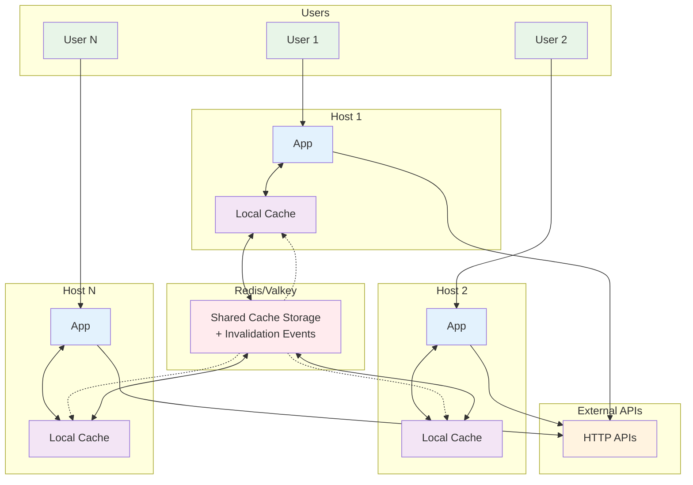
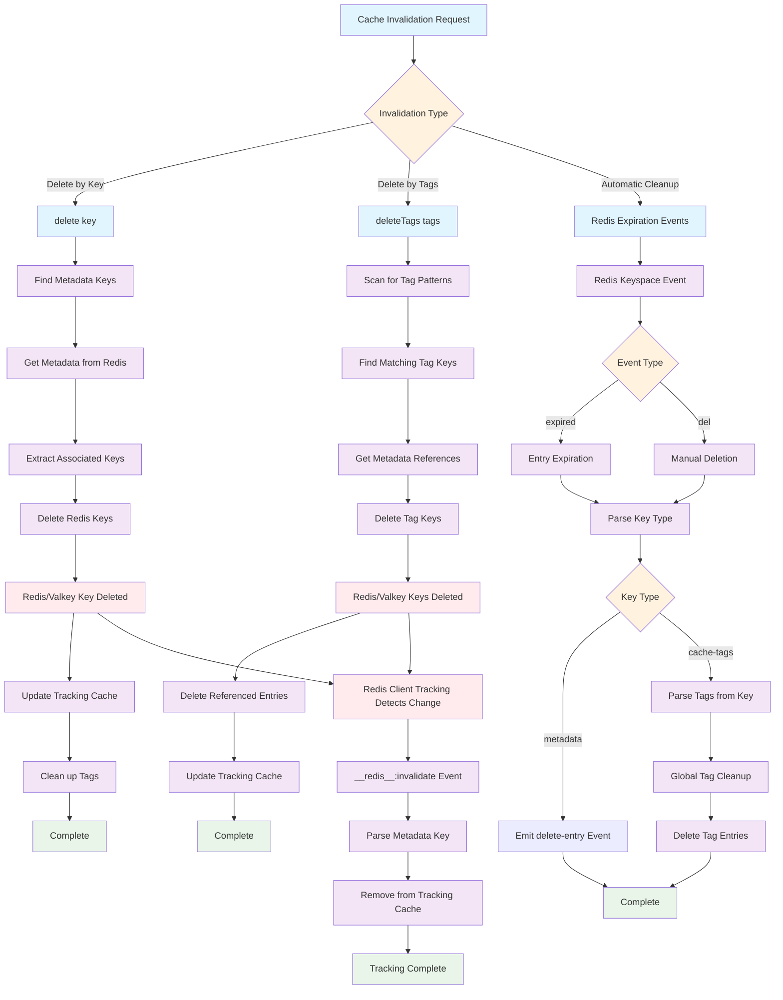

# undici-cache-redis

A high-performance Redis-backed cache store for [Undici's](https://github.com/nodejs/undici) cache interceptor. This library provides seamless HTTP response caching with Redis/Valkey as the storage backend, featuring client-side caching, cache invalidation by tags, and support for managed Redis environments.

Built on top of [iovalkey](https://github.com/valkey-io/iovalkey) for optimal Redis/Valkey connectivity.

## Features

- 🚀 **High Performance**: Redis-backed caching with client-side optimization
- 🏷️ **Cache Tags**: Invalidate cached responses by custom tags
- 🔄 **Automatic Invalidation**: Smart cache invalidation on mutating operations
- 📊 **Cache Management**: Built-in cache manager for monitoring and administration
- 🌐 **Vary Header Support**: Proper handling of content negotiation
- ☁️ **Cloud Ready**: Works with managed Redis services (AWS ElastiCache, etc.)
- 💾 **Binary Support**: Handles both text and binary response data
- 📈 **Tracking Cache**: Client-side caching for improved performance

## Installation

```bash
npm install undici-cache-redis
```

## Quick Start

### Basic Usage

```javascript
import { Agent, interceptors } from 'undici'
import { RedisCacheStore } from 'undici-cache-redis'

// Create a Redis cache store
const store = new RedisCacheStore({
  clientOpts: {
    host: 'localhost',
    port: 6379,
    keyPrefix: 'my-app:cache:'
  }
})

// Create Undici agent with caching
const agent = new Agent()
  .compose(interceptors.cache({ store }))

// Make requests - responses will be automatically cached
const response = await agent.request({
  origin: 'https://api.example.com',
  method: 'GET',
  path: '/users/123'
})

console.log(await response.body.text())
```

### Cache Invalidation by Tags

```javascript
import { Agent, interceptors } from 'undici'
import { RedisCacheStore } from 'undici-cache-redis'

const store = new RedisCacheStore({
  cacheTagsHeader: 'cache-tags' // Header to read cache tags from
})

const agent = new Agent()
  .compose(interceptors.cache({ store }))

// Server responds with: Cache-Tags: user:123,profile
const response = await agent.request({
  origin: 'https://api.example.com',
  method: 'GET',
  path: '/users/123'
})

// Later, invalidate all cached responses tagged with 'user:123'
await store.deleteTags(['user:123'])
```

### Advanced Cache Management with RedisCacheManager

```javascript
import { RedisCacheStore, RedisCacheManager } from 'undici-cache-redis'

// Create both store and manager
const store = new RedisCacheStore({
  cacheTagsHeader: 'cache-tags'
})

const manager = new RedisCacheManager({
  clientOpts: { host: 'localhost', port: 6379 }
})

// Subscribe to cache events
await manager.subscribe()

manager.on('add-entry', (entry) => {
  console.log('Cache entry added:', entry.path, entry.cacheTags)
})

manager.on('delete-entry', ({ id, keyPrefix }) => {
  console.log('Cache entry deleted:', id)
})

// Analyze cache contents
await manager.streamEntries((entry) => {
  console.log(`Entry: ${entry.path}, Tags: [${entry.cacheTags.join(', ')}]`)
}, '')

// Invalidate by tags using the store
await store.deleteTags(['user:123', 'products'])

// Clean up specific entries by ID
const entriesToDelete = []
await manager.streamEntries((entry) => {
  if (entry.path.startsWith('/api/products/')) {
    entriesToDelete.push(entry.id)
  }
}, '')

if (entriesToDelete.length > 0) {
  await manager.deleteIds(entriesToDelete, '')
}

// Get response body for debugging
const responseBody = await manager.getResponseById('some-entry-id', '')
```

### Cache Management

```javascript
import { RedisCacheManager } from 'undici-cache-redis'

const manager = new RedisCacheManager({
  clientOpts: {
    host: 'localhost',
    port: 6379
  }
})

// Subscribe to cache events
await manager.subscribe()

manager.on('add-entry', (entry) => {
  console.log('Cache entry added:', entry.id)
})

manager.on('delete-entry', ({ id, keyPrefix }) => {
  console.log('Cache entry deleted:', id)
})

// Stream all cache entries
await manager.streamEntries((entry) => {
  console.log('Entry:', entry.origin, entry.path, entry.statusCode)
}, 'my-app:cache:')

// Get response body by ID
const responseBody = await manager.getResponseById('entry-id', 'my-app:cache:')
```

## Configuration Options

### RedisCacheStore Options

```typescript
interface RedisCacheStoreOpts {
  // Use an existing iovalkey Redis or Cluster client (not closed by close())
  client?: Redis | Cluster

  // Defaults to "cluster" when clusterUrl or startupNodes is set
  mode?: "standalone" | "cluster" | "auto"

  // Valkey/Redis Cluster endpoint. Can be an AWS ElastiCache
  // configuration endpoint host or redis:// / rediss:// URL.
  clusterUrl?: string

  // Valkey/Redis Cluster startup nodes and iovalkey cluster options
  startupNodes?: ClusterNode | ClusterNode[]
  clusterOptions?: ClusterOptions

  // Prefix applied by this library. Prefer this over clientOpts.keyPrefix.
  keyPrefix?: string

  // Redis client options (passed to iovalkey)
  clientOpts?: {
    host?: string
    port?: number
    keyPrefix?: string
    // ... other iovalkey options
  }
  
  // Maximum size in bytes for a single cached response
  maxEntrySize?: number

  // Allow explicitly cacheable 5xx responses to be stored (default: false)
  cacheErrorResponses?: boolean
  
  // Maximum total cache size (for client-side cache)
  maxSize?: number
  
  // Maximum number of entries (for client-side cache)
  maxCount?: number
  
  // Enable/disable client-side tracking cache (default: true, not
  // available in cluster mode)
  tracking?: boolean
  
  // Header name to read cache tags from responses
  cacheTagsHeader?: string
  
  // Error callback function
  errorCallback?: (err: Error) => void
}
```

### RedisCacheManager Options

```typescript
interface RedisCacheManagerOpts {
  // Redis client options
  clientOpts?: {
    host?: string
    port?: number
    // ... other iovalkey options
  }
  
  // Whether to configure keyspace event notifications (default: true)
  // Set to false for managed Redis services
  clientConfigKeyspaceEventNotify?: boolean
}
```

## Advanced Usage Examples

### Using with fetch()

```javascript
import { Agent, interceptors, setGlobalDispatcher } from 'undici'
import { RedisCacheStore } from 'undici-cache-redis'

// Create a Redis cache store
const store = new RedisCacheStore()

// Create agent with caching
const agent = new Agent()
  .compose(interceptors.cache({ store }))

// Set as global dispatcher to enable caching for fetch
setGlobalDispatcher(agent)

// Now fetch() automatically uses the cache!
const response = await fetch('https://api.example.com/users/123')
const data = await response.json()

// Cache headers are available
if (response.headers.get('x-cache') === 'HIT') {
  console.log('Response was served from cache!')
}
```

### Working with Vary Headers

```javascript
const store = new RedisCacheStore()
const agent = new Agent()
  .compose(interceptors.cache({ store }))

// Different responses cached based on Accept-Language header
const responseEn = await agent.request({
  origin: 'https://api.example.com',
  method: 'GET',
  path: '/content',
  headers: { 'Accept-Language': 'en' }
})

const responseFr = await agent.request({
  origin: 'https://api.example.com',
  method: 'GET',
  path: '/content',
  headers: { 'Accept-Language': 'fr' }
})
```

### Manual Cache Operations

```javascript
const store = new RedisCacheStore()

// Delete specific cache entries
await store.deleteKeys([
  { origin: 'https://api.example.com', method: 'GET', path: '/users/123' }
])

// Delete by cache tags
await store.deleteTags(['user:123', 'profile'])

// Close the store when done
await store.close()
```

### Error Handling

```javascript
const store = new RedisCacheStore({
  errorCallback: (err) => {
    console.error('Cache error:', err.message)
    // Send to monitoring service
    monitoringService.error('cache_error', err)
  }
})
```

## Managed Redis Services

When using managed Redis services like AWS ElastiCache, some Redis commands may be restricted. Configure the cache manager accordingly:

```javascript
const manager = new RedisCacheManager({
  clientConfigKeyspaceEventNotify: false, // Disable auto-configuration
  clientOpts: {
    host: 'your-elasticache-endpoint.cache.amazonaws.com',
    port: 6379
  }
})
```

Ensure your managed Redis instance has the following configuration:
- `notify-keyspace-events AKE` (if not automatically configured)

## Multi-Host Architecture


```mermaid
graph TB
    subgraph "Users"
        U1[User 1]
        U2[User 2]
        U3[User N]
    end
    
    subgraph "Host 1"
        A1[App]
        B1[Local Cache]
    end
    
    subgraph "Host 2" 
        A2[App]
        B2[Local Cache]
    end
    
    subgraph "Host N"
        A3[App]
        B3[Local Cache]
    end
    
    subgraph "Redis/Valkey"
        R[Shared Cache Storage<br/>+ Invalidation Events]
    end
    
    subgraph "External APIs"
        API[HTTP APIs]
    end
    
    U1 --> A1
    U2 --> A2
    U3 --> A3
    
    A1 <--> B1
    A2 <--> B2
    A3 <--> B3
    
    B1 <--> R
    B2 <--> R
    B3 <--> R
    
    A1 --> API
    A2 --> API
    A3 --> API
    
    R -.-> B1
    R -.-> B2
    R -.-> B3
    
    classDef users fill:#e8f5e8
    classDef app fill:#e3f2fd
    classDef cache fill:#f3e5f5
    classDef redis fill:#ffebee
    classDef api fill:#fff3e0
    
    class U1,U2,U3 users
    class A1,A2,A3 app
    class B1,B2,B3 cache
    class R redis
    class API api
```

**Flow**: Users make requests → Apps check local/Redis cache → If miss, fetch from APIs → Cache responses → Invalidation events sync all hosts.

## Cache Key Structure

The library uses a structured approach to Redis keys:

- **Index keys**: `{prefix}index:{urlHash}` - one hash per origin + path, with one field per method and Vary variant
- **Value keys**: `{prefix}values:{urlHash}:{id}`
- **Metadata keys**: `{prefix}metadata:{urlHash}:{origin}:{path}:{method}:{id}`
- **ID keys**: `{prefix}ids:{id}`
- **Tag keys**: `{prefix}cache-tags:{urlHash}:{tag1}:{tag2}:{id}`
- **Tag index keys**: `{prefix}tag-index:{tagHash}` - a set of the index fields that have the tag

Where `{prefix}` is your configured `keyPrefix`. The braced `{urlHash}` is a Valkey/Redis Cluster hash tag, so every key read by a lookup lives in the same slot. Entry IDs are derived from the URL, method and Vary values unless an explicit `key.id` is supplied, so writing the same variant again overwrites it in place.

A lookup reads the index of a single URL (`HGETALL`) and then the selected value (`GET`). It never uses `SCAN` or `KEYS`, so its cost depends on the number of variants of that URL, not on the size of the database. Vary header names are normalized to lower case, request header matching is case-insensitive, `Vary: *` responses are not cached, and when several variants match the most specific one is returned.

`delete()`, `deleteKeys()` and `deleteTags()` also use the indexes instead of scanning. `RedisCacheManager` still scans for its maintenance operations (`streamEntries()`, `getDependentEntries()` and cross-prefix invalidation).

Index and tag index keys expire together with their longest-lived entry, and expired variants are removed from the index when the URL is written again.

### Cluster and Externally Supplied Clients

```javascript
import { Cluster, Redis } from 'iovalkey'
import { RedisCacheStore } from 'undici-cache-redis'

// Use an existing client. close() does not quit it.
const store = new RedisCacheStore({
  client: new Redis({ host: 'localhost', port: 6379 }),
  keyPrefix: 'my-app:'
})

// Valkey/Redis Cluster, discovered from a single endpoint
const clusterStore = new RedisCacheStore({
  clusterUrl: 'clustercfg.my-cache.xxxxxx.use1.cache.amazonaws.com:6379',
  clusterOptions: { scaleReads: 'master' },
  keyPrefix: 'my-app:'
})

// ...or from startup nodes, or an existing Cluster client
const startupNodesStore = new RedisCacheStore({ startupNodes: [{ host: '127.0.0.1', port: 7000 }] })
const externalClusterStore = new RedisCacheStore({ client: new Cluster([{ host: '127.0.0.1', port: 7000 }]) })
```

Client-side tracking is disabled in cluster mode, because tracking invalidations are delivered per node. With a standalone `client`, tracking is enabled on that connection, so pass `tracking: false` if the client is shared with code that should not be tracked.

`npm run test:cluster` runs the store against the local three-node cluster started by `npm run valkey`.

For AWS ElastiCache with cluster mode enabled, pass the configuration endpoint as `clusterUrl`. Use a `rediss://` URL or `clientOpts.tls` when in-transit encryption is enabled:

```javascript
const store = new RedisCacheStore({
  clusterUrl: 'rediss://clustercfg.my-cache.xxxxxx.use1.cache.amazonaws.com:6379',
  keyPrefix: 'my-service:cache:',
  clientOpts: {
    username: 'default',
    password: process.env.ELASTICACHE_AUTH_TOKEN,
    tls: {}
  }
})
```

### Migration Notes

Entries written by previous versions are not indexed, so lookups don't find them. Flush the cache when upgrading, or let the old entries expire.


## Cache Invalidation Flow

The following diagram illustrates how cache invalidation works across different scenarios:


```mermaid
flowchart TD
    A[Cache Invalidation Request] --> B{Invalidation Type}
    
    B -->|Delete by Key| C[delete key]
    B -->|Delete by Tags| D[deleteTags tags]
    B -->|Automatic Cleanup| E[Redis Expiration Events]
    
    C --> F[Find Metadata Keys]
    F --> G[Get Metadata from Redis]
    G --> H[Extract Associated Keys]
    H --> I[Delete Redis Keys]
    I --> JJ[Redis/Valkey Key Deleted]
    JJ --> J[Update Tracking Cache]
    J --> K[Clean up Tags]
    K --> L[Complete]
    
    D --> M[Scan for Tag Patterns]
    M --> N[Find Matching Tag Keys]
    N --> O[Get Metadata References]
    O --> P[Delete Tag Keys]
    P --> PP[Redis/Valkey Keys Deleted]
    PP --> Q[Delete Referenced Entries]
    Q --> R[Update Tracking Cache]
    R --> S[Complete]
    
    E --> T[Redis Keyspace Event]
    T --> U{Event Type}
    U -->|expired| V[Entry Expiration]
    U -->|del| W[Manual Deletion]
    
    V --> X[Parse Key Type]
    X --> Y{Key Type}
    Y -->|metadata| Z[Emit delete-entry Event]
    Y -->|cache-tags| AA[Parse Tags from Key]
    AA --> BB[Global Tag Cleanup]
    BB --> CC[Delete Tag Entries]
    CC --> DD[Complete]
    
    W --> X
    Z --> DD
    
    %% Client-side tracking invalidation triggered by Redis updates
    JJ --> EE[Redis Client Tracking Detects Change]
    PP --> EE
    EE --> FF[__redis__:invalidate Event]
    FF --> GG[Parse Metadata Key]
    GG --> HH[Remove from Tracking Cache]
    HH --> II[Tracking Complete]
    
    %% Styling
    classDef primary fill:#e1f5fe
    classDef process fill:#f3e5f5
    classDef decision fill:#fff3e0
    classDef complete fill:#e8f5e8
    classDef redis fill:#ffebee
    
    class A,C,D,E primary
    class F,G,H,I,J,K,M,N,O,P,Q,R,T,V,W,X,AA,BB,CC,FF,GG,HH process
    class B,U,Y decision
    class L,S,DD,II complete
    class JJ,PP,EE redis
```

### Invalidation Methods

1. **Direct Key Deletion**: Targets specific cache entries by URL pattern
2. **Tag-based Deletion**: Removes all entries associated with given cache tags
3. **Automatic Expiration**: Handles Redis TTL expiration and manual deletions
4. **Client-side Tracking**: Maintains local cache consistency via Redis invalidation notifications

## Performance Considerations

1. **Client-side Tracking**: Enabled by default, serves repeated lookups from memory, including misses for URLs with nothing cached, and is invalidated by the server
2. **Indexed Lookups**: A lookup is two commands on one slot, independent of the database size
3. **Pipeline Operations**: Commands are auto-pipelined
4. **Binary Data**: Efficiently handles binary responses with base64 encoding
5. **Memory Management**: Configurable size limits prevent memory exhaustion

## API Reference

### RedisCacheStore

#### Methods

- `get(key: CacheKey): Promise<GetResult | undefined>` - Retrieve cached response
- `createWriteStream(key: CacheKey, value: CachedResponse): Writable | undefined` - Create a write stream for cacheable responses
- `delete(key: CacheKey): Promise<void>` - Delete cache entries by key pattern
- `deleteKeys(keys: CacheKey[]): Promise<void>` - Delete multiple cache entries
- `deleteTags(tags: string[]): Promise<void>` - Delete entries by cache tags
- `close(): Promise<void>` - Close Redis connections

#### Events

- `write` - Emitted when a cache entry is written

### RedisCacheManager

#### Methods

- `streamEntries(callback, keyPrefix): Promise<void>` - Stream all cache entries
- `subscribe(): Promise<void>` - Subscribe to cache events
- `getResponseById(id, keyPrefix): Promise<string | null>` - Get response body by ID
- `getDependentEntries(id, keyPrefix): Promise<CacheEntry[]>` - Get entries sharing cache tags
- `deleteIds(ids, keyPrefix): Promise<void>` - Delete entries by IDs
- `close(): Promise<void>` - Close connections

#### Events

- `add-entry` - Emitted when a cache entry is added
- `delete-entry` - Emitted when a cache entry is deleted
- `error` - Emitted on errors

## Troubleshooting

### Common Issues

**Connection Errors**
```javascript
// Ensure Redis is running and accessible
const store = new RedisCacheStore({
  clientOpts: {
    host: 'localhost',
    port: 6379,
    connectTimeout: 10000,
    retryDelayOnFailover: 100
  }
})
```

**Memory Issues**
```javascript
// Limit cache size to prevent memory exhaustion
const store = new RedisCacheStore({
  maxEntrySize: 1024 * 1024, // 1MB per entry
  maxSize: 100 * 1024 * 1024, // 100MB total
  maxCount: 10000 // Max 10k entries
})
```

**Managed Redis Issues**
```javascript
// For AWS ElastiCache or similar services
const manager = new RedisCacheManager({
  clientConfigKeyspaceEventNotify: false,
  clientOpts: {
    host: 'your-cluster.cache.amazonaws.com',
    port: 6379,
    family: 4, // Force IPv4
    enableReadyCheck: false
  }
})
```

## Requirements

- Node.js >= 20
- Redis >= 7.0 or Valkey >= 7.2, with `EVAL` allowed (used to drop expired variants safely)
- Undici >= 7.0

## License

Licensed under the Apache License, Version 2.0 (the "License");
you may not use this file except in compliance with the License.
You may obtain a copy of the License at

    http://www.apache.org/licenses/LICENSE-2.0

Unless required by applicable law or agreed to in writing, software
distributed under the License is distributed on an "AS IS" BASIS,
WITHOUT WARRANTIES OR CONDITIONS OF ANY KIND, either express or implied.
See the License for the specific language governing permissions and
limitations under the License.

## Benchmarking

This project includes comprehensive benchmarks to measure performance improvements with different caching strategies.

### Quick Benchmark
```bash
# Automated benchmark with all prerequisites checked
./run-benchmarks.sh

# Or run manually
npm run bench
```

The benchmarks test a realistic proxy server architecture:
- **Server Foo (Proxy)**: Uses Undici with different cache configurations  
- **Server Bar (Backend)**: API server with simulated latency
- **Autocannon**: Load testing tool measuring performance

Expected results show **10-15x performance improvement** with caching enabled.

For detailed benchmarking instructions, see [benchmarks/README.md](./benchmarks/README.md).

To measure the store alone, against a database that also holds unrelated keys, with one or several processes sharing the same hot URLs like the replicas of a deployment:

```bash
node benchmarks/pods.js --pods 1 --concurrency 64 [--tracking off]
node benchmarks/pods.js --pods 4 --ratios 0.2,0.45,0.75,0.95
```

## Contributing

This project is part of the Platformatic ecosystem. For contributing guidelines, please refer to the main [Platformatic repository](https://github.com/platformatic/platformatic).

## Related Projects

- [Undici](https://github.com/nodejs/undici) - HTTP/1.1 client for Node.js
- [iovalkey](https://github.com/valkey-io/iovalkey) - High-performance Valkey client
- [Platformatic](https://github.com/platformatic/platformatic) - Enterprise-Ready Node.js
